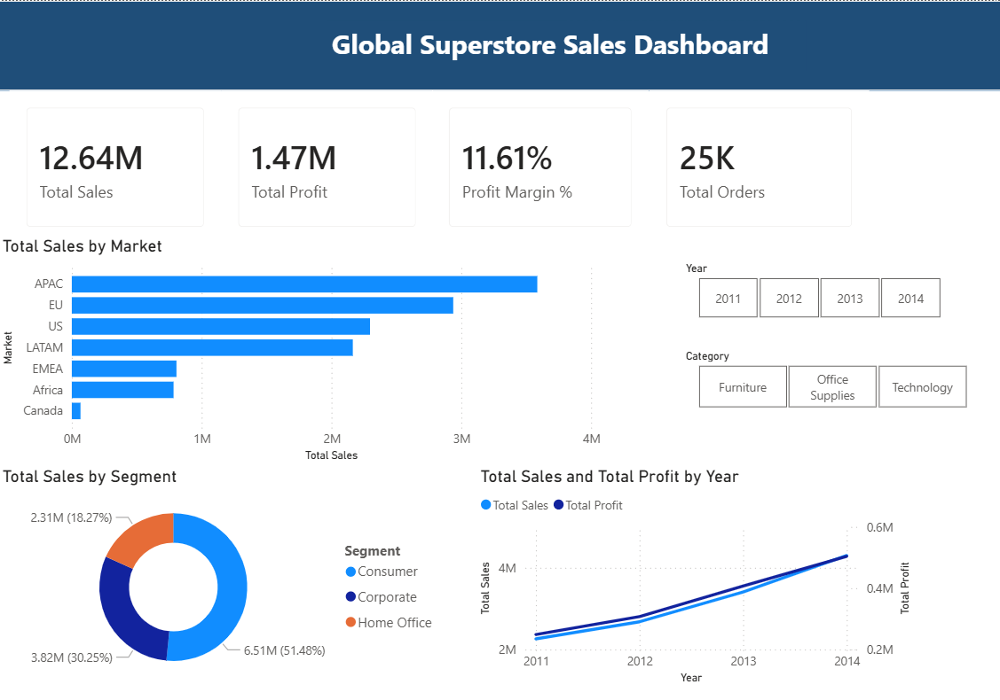
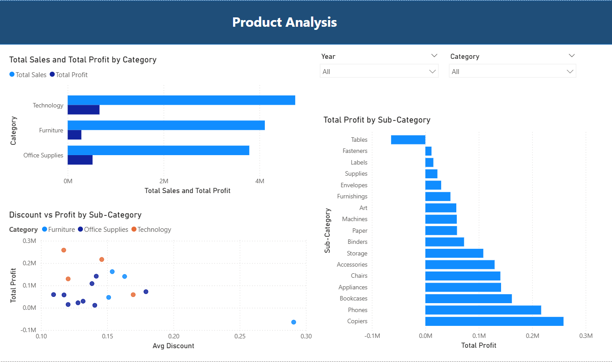
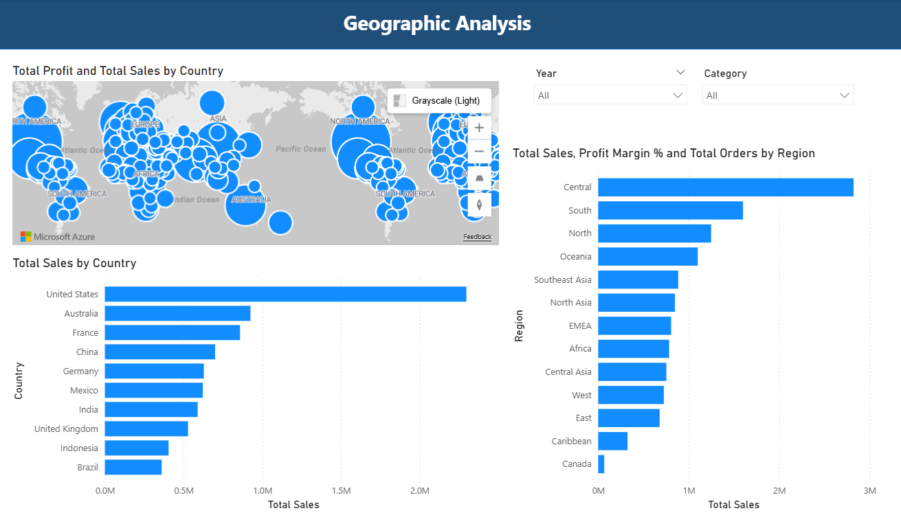
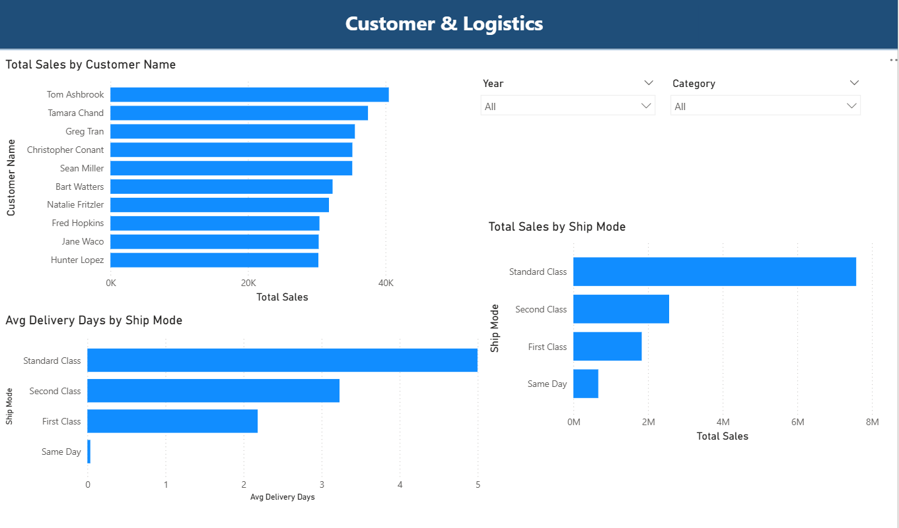

# Global Superstore Sales Dashboard — Power BI

An end-to-end business intelligence project built on a real-world Kaggle dataset. This project covers the full data workflow from raw data cleaning in Python to an interactive 4-page Power BI dashboard delivering actionable business insights.

---

## Dashboard Preview

| Page 1 — Executive Summary | Page 2 — Product Analysis |
|---|---|
|  |  |

| Page 3 — Geographic Analysis | Page 4 — Customer and Logistics |
|---|---|
|  |  |

---

## Project Overview

| Detail | Info |
|---|---|
| Dataset | Global Superstore (Kaggle) |
| Rows | 51,290 records |
| Countries | 147 |
| Markets | 7 (APAC, EU, US, LATAM, EMEA, Africa, Canada) |
| Time Period | 2011 to 2014 |
| Tools Used | Power BI, Python, Pandas, DAX |

---

## Tools and Technologies

- **Power BI** — Data modeling, DAX measures, interactive dashboard
- **Python (Pandas)** — Data cleaning, feature engineering, EDA
- **DAX** — Business measures and time intelligence calculations
- **Star Schema** — Data modeling with dedicated DateTable

---

## Project Workflow

### Step 1 — Exploratory Data Analysis (Python)
- Loaded raw CSV and profiled data shape, types and missing values
- Identified date format inconsistencies across Order Date and Ship Date columns
- Detected negative profit orders and high discount patterns
- Engineered the Delivery Days feature from Order Date and Ship Date

### Step 2 — Data Cleaning (Python and Pandas)
- Standardized date formats across all date columns
- Removed duplicates and handled missing values
- Validated all numeric columns for outliers
- Exported clean CSV ready for Power BI

### Step 3 — Data Modeling (Power BI)
- Built a star schema with a dedicated DateTable
- Established one-to-many relationships between DateTable and fact table
- Organized all measures in a dedicated measures table

### Step 4 — DAX Measures
Ten or more measures were created including:

| Measure | Formula Description |
|---|---|
| Total Sales | SUM of all sales values |
| Total Profit | SUM of all profit values |
| Profit Margin % | Total Profit divided by Total Sales |
| Total Orders | DISTINCTCOUNT of Order IDs |
| Avg Order Value | Total Sales divided by Total Orders |
| Avg Delivery Days | AVERAGE of Delivery Days column |
| YoY Sales Growth % | Year over year sales growth using SAMEPERIODLASTYEAR |
| Total Quantity | SUM of quantity ordered |
| Avg Discount | AVERAGE of discount values |
| Total Shipping Cost | SUM of shipping cost values |

### Step 5 — Dashboard Pages

**Page 1 — Executive Summary**
- KPI cards showing Total Sales ($12.64M), Total Profit ($1.47M), Profit Margin (11.61%) and Total Orders (25K)
- Sales and Profit trend line by year (2011 to 2014)
- Sales by Customer Segment donut chart
- Sales by Market bar chart
- Year and Category slicers for dynamic filtering

**Page 2 — Product Analysis**
- Sales and Profit by Category clustered bar chart
- Profit by Sub-Category bar chart sorted ascending to highlight losses
- Discount vs Profit scatter plot color coded by Category

**Page 3 — Geographic Analysis**
- Azure Map bubble chart showing profit by country across 147 countries
- Top 10 Countries by Sales bar chart
- Sales by Region bar chart across 13 regions

**Page 4 — Customer and Logistics**
- Top 10 Customers by Sales bar chart
- Sales by Ship Mode bar chart
- Avg Delivery Days by Ship Mode bar chart

---

## Key Business Insights

- **24.5% of all orders are loss-making** due to discounts exceeding 20%
- **Tables sub-category loses $64K total** and is the only consistently unprofitable product line
- **Copiers generate $258K profit** — the highest of all sub-categories
- **APAC is the largest market** at over $3.5M in total sales
- **Standard Class shipping** is used for over 60% of all orders
- **Technology products with lower discounts** consistently generate the highest profit margins
- **Sales grew 90% from 2011 to 2014** — from $2.26M to $4.30M

---

## Repository Structure

```
global-superstore-powerbi/
│
├── README.md
├── dashboard/
│   └── GlobalSuperstore_Dashboard.pbix
├── data/
│   └── superstore_cleaned.csv
├── python/
│   └── cleaning_script.py
└── screenshots/
    ├── Page1_Executive_Summary.png
    ├── Page2_Product_Analysis.png
    ├── Page3_Geographic_Analysis.png
    └── Page4_Customer_Logistics.png
```

---

## How to Run

1. Clone this repository
2. Open `dashboard/GlobalSuperstore_Dashboard.pbix` in Power BI Desktop
3. If data does not load, go to Transform Data and update the file path to point to `data/superstore_cleaned.csv`
4. Click Refresh and all visuals will update

---

## Author

**Lakshmi Keerthana Tatikonda**
MS Computer Science — Virginia Commonwealth University
[LinkedIn](https://www.linkedin.com/in/lakshmi-keerthana-tatikonda-5671b021a/)

---

## Dataset Source

Global Superstore dataset available on [Kaggle](https://www.kaggle.com/)


